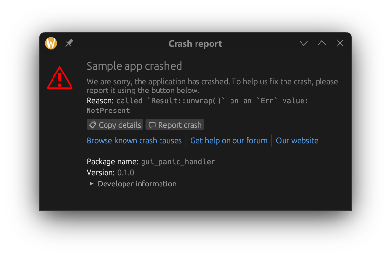

# GUI panic handler



This crate allows you to handle crashes with a GUI dialog made with [egui](https://github.com/emilk/egui).

The dialog shows panic payload, information about location of the panic and
if you want, an option to report the panic to developer and external links.

### Quickstart

```rust
fn main() {
    use gui_panic_handler::AppInfo;
    use gui_panic_handler::Link;

    gui_panic_handler::register(AppInfo {
        name: "GUI panic handler testing app",
        additional_text: "We are sorry, the app crashed. To let us fix the crash, please report it using the button below.",
        links: vec![
            Link {
                label: "Browse known crash causes",
                url: "https://example.com",
            },
            Link {
                label: "Get help on the forum",
                url: "https://example.com",
            },
            Link {
                label: "Our website",
                url: "https://example.com",
            },
        ],
        report_bug_url: Some(gui_panic_handler::github_report_bug_url(
            String::from("FireFragment"),
            String::from("rust_gui_panic_handler"),
        )),
    });

    println!("Reading env var...");
    let env_var_value = std::env::var("SUPER_IMPORTANT_ENVIRONMENT_VARIABLE").unwrap(); // Here we panic

    println!("Read: {env_var_value}")
}
```


If you use [nix](https://nixos.org/) with flakes, you can see the dialog yourself just by running:
```shell
nix run git+https://github.com/FireFragment/rust_gui_panic_handler
```
